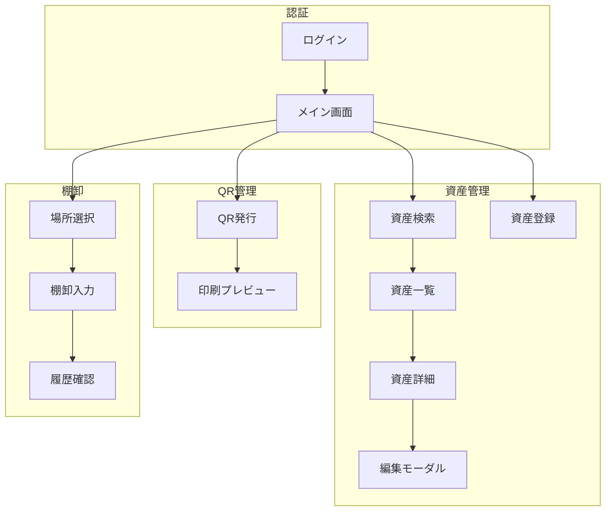

# 第7章：基本設計（画面設計）の進め方

## 7.1 画面設計の全体フロー

### フロー概要

```
┌─────────────┐    ┌─────────────┐    ┌─────────────┐    ┌─────────────┐
│  画面一覧   │ → │  モック作成  │ → │  レビュー   │ → │  修正反映   │
│  作成      │    │             │    │             │    │             │
└─────────────┘    └─────────────┘    └─────────────┘    └─────────────┘
                          ↑                                    │
                          └─────────── 反復改善 ───────────────┘
```

### 各フェーズの作業内容

| フェーズ | 作業内容 | 成果物 |
|---------|---------|--------|
| 画面一覧作成 | 必要画面の洗い出し | 画面一覧表 |
| モック作成 | HTML/Reactでの実装 | 動作するモック |
| レビュー | 顧客確認、フィードバック | レビューコメント |
| 修正反映 | フィードバックの反映 | 改訂版モック |

### モック駆動開発のポイント

```
【従来の手法】
要件定義 → 基本設計（紙ベース）→ 詳細設計 → 実装 → テスト
                ↓
          認識齟齬が後工程で発覚

【モック駆動開発】
要件定義 → モック作成 ⇄ レビュー → 実装 → テスト
                  ↓
          早期に認識を合わせられる
```

---

## 7.2 画面一覧の作成

### 画面洗い出しプロンプト

```
以下の機能一覧から、必要な画面を洗い出して。

【機能一覧】
1. 認証・認可
   - ログイン、ログアウト
2. 資産管理
   - 検索、一覧、詳細、登録、編集
3. QRコード管理
   - 発行、印刷
4. 棚卸管理
   - 場所選択、資産入力、履歴確認
5. 修理管理
   - 依頼、ステータス確認、完了登録

【出力形式】
| 画面ID | 画面名 | 機能 | 主要ユーザー | 備考 |
の表形式で出力して。
```

**出力例**：
```markdown
| 画面ID | 画面名 | 機能 | 主要ユーザー | 備考 |
|--------|--------|------|-------------|------|
| SCR-001 | ログイン | 認証 | 全員 | - |
| SCR-002 | メイン（ダッシュボード） | 認証 | 全員 | ログイン後の初期画面 |
| SCR-003 | 資産検索 | 資産管理 | 機器担当 | - |
| SCR-004 | 資産一覧 | 資産管理 | 機器担当 | 検索結果表示 |
| SCR-005 | 資産詳細 | 資産管理 | 機器担当 | 編集機能含む |
| SCR-006 | 資産登録 | 資産管理 | 機器担当 | - |
| SCR-007 | QR発行 | QR管理 | 機器担当 | - |
| SCR-008 | QR印刷プレビュー | QR管理 | 機器担当 | - |
| SCR-009 | 棚卸場所選択 | 棚卸 | 現場スタッフ | オフライン対応 |
| SCR-010 | 棚卸入力 | 棚卸 | 現場スタッフ | QRスキャン |
| SCR-011 | 棚卸履歴 | 棚卸 | 現場スタッフ | - |
| SCR-012 | 修理依頼 | 修理管理 | 機器担当 | - |
| SCR-013 | 修理ステータス | 修理管理 | 修理業者 | - |
```

---

### 画面遷移の整理プロンプト

```
画面一覧を基に、画面遷移図をMermaid記法で作成して。

【整理観点】
- ユーザー種別ごとのフローを色分け
- 主要フローを明示
- モーダルは別ノードで表現

【出力形式】
Mermaid flowchart
```

**出力例**：


---

## 7.3 画面モック作成

### 初期モック生成プロンプト

```
以下の画面のモックを作成して。

【画面名】
ログイン画面

【画面概要】
ユーザーがID/パスワードを入力してログインする画面

【要素】
- ロゴ（システム名表示）
- ユーザーID入力欄
- パスワード入力欄
- ログインボタン
- パスワードを忘れた方リンク

【デザイン方針】
- シンプルで清潔感のあるデザイン
- メインカラー：緑系（#27ae60）
- 中央配置

【技術】
- Next.js App Router
- TypeScript
- インラインスタイル（Tailwindなし）
```

---

### レスポンシブ対応プロンプト

```
この画面をレスポンシブ対応して。

【対応デバイス】
- PC（1024px以上）
- タブレット（768px〜1023px）
- スマートフォン（767px以下）

【各デバイスでの表示方針】
- PC: 2カラムレイアウト
- タブレット: 1カラム、余白調整
- スマートフォン: 1カラム、フォントサイズ縮小

【実装方法】
useResponsiveフックを使用して、isMobile, isTabletで分岐
```

---

### 状態バリエーションプロンプト

```
この画面の以下の状態バリエーションを実装して。

【状態一覧】
1. 初期状態（データなし）
2. データあり状態
3. ローディング状態
4. エラー状態
5. 空検索結果状態

【各状態の表示内容】
- 初期状態: 説明文とアクションボタン
- ローディング: スケルトン表示
- エラー: エラーメッセージと再試行ボタン
- 空結果: 「該当データがありません」メッセージ
```

---

## 7.4 モックレビューと修正

### スクリーンショットフィードバック

スクリーンショットを撮影し、具体的な修正指示を行う方法：

```
この画面のスクリーンショットを見て修正して。
[スクリーンショットのパスを指定]

【修正点】
1. ヘッダーのロゴをもう少し大きく
2. 検索ボタンを右寄せに
3. テーブルの行間を広げる
4. 日付表示を「yyyy/MM/dd」形式に
```

---

### 効果的な修正指示の出し方

**良い例**：
```
「保存」ボタンを画面右下に固定配置して。
フッターとして常に表示されるようにする。
高さは60px、背景色は白、上部にボーダー線を追加。
```

**悪い例**：
```
ボタンの位置を変えて。
もっと使いやすくして。
```

---

### 反復改善のコツ

1. **1回の指示は3点以内**
   - 多すぎると漏れが発生
   - 優先度の高いものから指示

2. **具体的な数値を指定**
   - 「大きく」ではなく「24px」
   - 「右に」ではなく「右端から20pxの位置に」

3. **理由も伝える**
   - 「視認性向上のため」
   - 「操作ミス防止のため」

4. **完成イメージを共有**
   - 参考画像があれば添付
   - 期待する動作を具体的に記述

---

## 7.5 成果物

### 画面一覧表テンプレート

```markdown
# 画面一覧

| No | 画面ID | 画面名 | 概要 | 主要機能 | 遷移元 | 遷移先 | ステータス |
|----|--------|--------|------|---------|--------|--------|-----------|
| 1 | SCR-001 | ログイン | 認証画面 | ログイン | - | メイン | 完了 |
| 2 | SCR-002 | メイン | ダッシュボード | 機能選択 | ログイン | 各画面 | 完了 |
| 3 | SCR-003 | 資産検索 | 検索条件入力 | 検索 | メイン | 一覧 | レビュー中 |
```

### モック管理表テンプレート

```markdown
# モック進捗管理

| 画面ID | 画面名 | 初版作成 | レビュー1 | 修正1 | レビュー2 | 承認 |
|--------|--------|---------|----------|-------|----------|------|
| SCR-001 | ログイン | 1/10 | 1/12 | 1/13 | 1/15 | 1/15 |
| SCR-002 | メイン | 1/11 | 1/14 | 1/16 | - | - |
| SCR-003 | 資産検索 | 1/12 | - | - | - | - |
```
