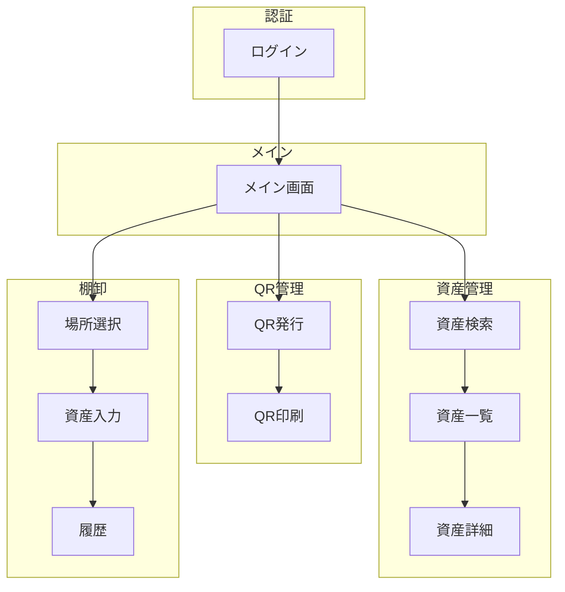

# 第9章：設計ドキュメント自動生成

## 9.1 画面遷移図の生成

### 概要

モックから自動的に画面遷移図を生成することで、設計ドキュメントの作成工数を削減できます。

### 生成プロンプト

```
プロジェクト内の全画面ファイルを分析して、画面遷移図を作成して。

【分析対象】
app/ ディレクトリ配下のpage.tsxファイル

【抽出情報】
- 画面名（ファイルパスから推測）
- 遷移先（router.push、Linkコンポーネントから抽出）
- 遷移条件（条件分岐がある場合）

【出力形式】
1. Mermaid記法のフローチャート
2. 画面遷移マトリクス（表形式）
```

### 出力例：Mermaid形式



### 出力例：画面遷移マトリクス

```markdown
| 遷移元 | 遷移先 | トリガー | 条件 |
|--------|--------|---------|------|
| ログイン | メイン | ログイン成功 | 認証OK |
| メイン | 資産検索 | メニュークリック | - |
| メイン | QR発行 | メニュークリック | - |
| メイン | 場所選択 | メニュークリック | - |
| 資産検索 | 資産一覧 | 検索実行 | - |
| 資産一覧 | 資産詳細 | 行クリック | - |
| QR発行 | QR印刷 | プレビュー | - |
| 場所選択 | 資産入力 | 次へ | 場所選択済 |
| 資産入力 | 履歴 | 履歴表示 | - |
```

### Excel出力プロンプト

```
画面遷移図をExcelファイルとして出力して。

【シート構成】
1. 遷移図（Mermaidのコードをセルに記載）
2. 遷移マトリクス（表形式）
3. 画面一覧

【ファイル名】
screen-transition-diagram.xlsx

【出力先】
docs/design/
```

---

## 9.2 画面設計書の生成

### 概要

各画面のモックを分析し、画面設計書を自動生成します。

### 生成プロンプト

```
以下の画面ファイルを分析して、画面設計書を作成して。

【対象ファイル】
app/login/page.tsx

【抽出情報】
- 画面名
- 画面概要
- レイアウト構成
- 画面要素一覧（ID、名称、種類、必須/任意、バリデーション）
- ボタン/アクション一覧
- 遷移先
- 備考

【出力形式】
Markdown形式で出力して。
```

### 出力例

```markdown
# 画面設計書：ログイン画面

## 基本情報

| 項目 | 内容 |
|------|------|
| 画面ID | SCR-001 |
| 画面名 | ログイン |
| 画面概要 | ユーザー認証を行う画面 |
| URL | /login |
| 対応デバイス | PC / タブレット / スマホ |

## レイアウト

```
+----------------------------------+
|           [ロゴ]                 |
|         システム名               |
+----------------------------------+
|                                  |
|     +----------------------+     |
|     | ユーザーID           |     |
|     +----------------------+     |
|                                  |
|     +----------------------+     |
|     | パスワード           |     |
|     +----------------------+     |
|                                  |
|     +----------------------+     |
|     |    ログイン          |     |
|     +----------------------+     |
|                                  |
|     パスワードを忘れた方         |
|                                  |
+----------------------------------+
```

## 画面要素一覧

| No | 要素ID | 要素名 | 種類 | 必須 | 初期値 | バリデーション |
|----|--------|--------|------|------|--------|---------------|
| 1 | logo | ロゴ | 画像 | - | - | - |
| 2 | systemName | システム名 | テキスト | - | 医療機器管理システム | - |
| 3 | userId | ユーザーID | テキスト入力 | 必須 | 空 | 半角英数字 |
| 4 | password | パスワード | パスワード入力 | 必須 | 空 | 8文字以上 |
| 5 | loginBtn | ログイン | ボタン | - | - | - |
| 6 | forgotLink | パスワードを忘れた方 | リンク | - | - | - |

## アクション一覧

| No | アクション | トリガー | 処理内容 | 遷移先 |
|----|-----------|---------|---------|--------|
| 1 | ログイン | loginBtnクリック | 認証API呼出 | メイン画面（成功時） |
| 2 | パスワードリセット | forgotLinkクリック | - | パスワードリセット画面 |

## バリデーション

| 項目 | ルール | エラーメッセージ |
|------|--------|----------------|
| ユーザーID | 必須 | ユーザーIDを入力してください |
| ユーザーID | 半角英数字 | 半角英数字で入力してください |
| パスワード | 必須 | パスワードを入力してください |
| パスワード | 8文字以上 | 8文字以上で入力してください |

## 備考

- 認証失敗時はエラーメッセージを表示
- 3回失敗でアカウントロック
```

---

### Excel形式での出力プロンプト

```
全画面の画面設計書をExcelファイルとして出力して。

【シート構成】
- 表紙（プロジェクト情報）
- 画面一覧
- 各画面の設計書（画面ごとにシート）

【要素採番ルール】
- 画面ID: SCR-001, SCR-002, ...
- 要素ID: [画面ID]-[連番]（例: SCR-001-001）

【ファイル名】
screen-design-specification.xlsx

【出力先】
docs/design/
```

---

## 9.3 その他のドキュメント

### API設計書生成プロンプト

```
モックで使用しているモックデータとAPI呼び出しを分析して、
API設計書を作成して。

【出力内容】
- エンドポイント一覧
- 各APIの詳細（リクエスト/レスポンス）
- エラーコード一覧

【出力形式】
OpenAPI 3.0形式（YAML）
```

---

### データベース設計書生成プロンプト

```
モックで使用している型定義とデータ構造を分析して、
データベース設計書を作成して。

【出力内容】
- テーブル一覧
- ER図（Mermaid）
- テーブル定義（カラム、型、制約）

【出力形式】
Markdown + Mermaid
```

---

### テスト仕様書生成プロンプト

```
画面設計書を基に、テスト仕様書を作成して。

【テスト観点】
- 画面表示
- 入力チェック
- ボタン動作
- 遷移確認

【出力形式】
| テストID | テスト項目 | 手順 | 期待結果 | 結果 |
の表形式
```

---

## 9.4 ドキュメント生成のワークフロー

### 推奨ワークフロー

```
1. モック完成
      ↓
2. 画面遷移図生成
      ↓
3. 画面設計書生成
      ↓
4. レビュー・修正
      ↓
5. 確定版出力（Excel）
      ↓
6. 顧客提出
```

### 一括生成プロンプト

```
プロジェクトの設計ドキュメントを一括生成して。

【生成するドキュメント】
1. 画面一覧（docs/design/screen-list.md）
2. 画面遷移図（docs/design/screen-transition.md）
3. 画面設計書（docs/design/screen-specs/配下に画面ごとに作成）

【注意事項】
- 既存ファイルがある場合は上書き確認
- 生成完了後に一覧を表示
```

---

## 9.5 ドキュメント管理のTips

### バージョン管理

```markdown
## 変更履歴

| バージョン | 日付 | 変更者 | 変更内容 |
|-----------|------|--------|---------|
| 1.0 | 2025/01/15 | 田中 | 初版作成 |
| 1.1 | 2025/01/20 | 田中 | 資産詳細画面追加 |
| 1.2 | 2025/01/25 | 鈴木 | レビュー指摘反映 |
```

### 命名規則

| ドキュメント種別 | ファイル名パターン | 例 |
|----------------|-------------------|-----|
| 画面設計書 | `screen-[画面ID].md` | `screen-scr001.md` |
| 画面遷移図 | `screen-transition.md` | - |
| API設計書 | `api-specification.yaml` | - |
| テスト仕様書 | `test-[画面ID].md` | `test-scr001.md` |
